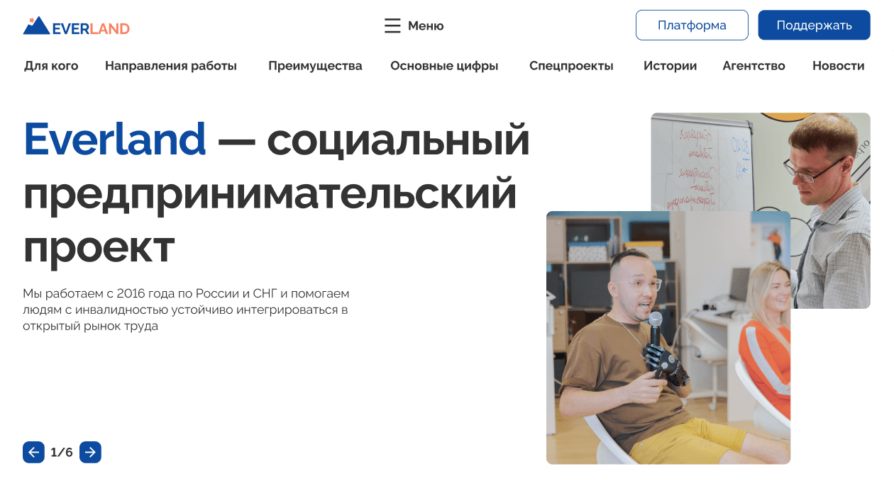

# Everland

---

## 🌐 Ссылки

* [Everland](https://andrey-grishkov.github.io/Everland/#) - страница на хостинге GH Pages;
* [Brief](https://www.notion.so/Everland-1-9c4229cab9644888b709bae9d15369cb) - бриф проекта Everland;
* [Figma](https://www.figma.com/file/59a1PXM1KLWN0hWWMl1Kni/Everland-(Веб%2B)?type=design&node-id=430-712&t=745u5bBGQgqZnntj-0) - макет проекта;

---

## 📗 О проекте Everland
__Everland__ — социальный предпринимательский проект.

__Инклюзивное пространство__, которое дает возможности профессионального роста, интеллектуального развития для людей с инвалидностью.

__Объединение людей__ с инвалидностью и без нее с целью обмена профессиональным опытом и профессиональной взаимопомощи.

_Подробнее о деятельности проекта можно прочитать_ [по ссылке](https://evland.ru/main/o_project/)

_Главная страница_

---

## 🥣 Немного о реализации
* Реализована _front-end_ часть главной страницы проекта Everland.
* Проект _свёрстан_ с использованием технологий адаптивной вёрстки и отзывчивого интерфейса для наиболее популярных разрешений.
* При стилизации используется _flex-структура_:
  * `flat` — для простых блоков;
  * `nested` — для сложных;
* Реализовано раскрывающееся основное меню типа _burger_.
* Cтраницу открывает _слайдер_ с основной информацией о проекте.
* Секция __Главное в работе__ включает в себя адаптивные элементы типа _аккордеон_ с плавной анимацией.
* Секция __Поддержите нас__ включает полнофункциональную _форму_ для сбора пожертвований на развитие проекта.

* Сборка проекта, минимизация и транспиляция кода на JS происходит с помощью инструмента __Webpack__ и сопутствующих плагинов.

---

## 📈 Планы по развитию проекта
* Реализовать другие страницы и разделы сайта
* Подключить функционал сбора пожертвований
---

## ⚙️ Cтек технологий
HTML, CSS & SASS, JavaScript, WebPack, GitHub

          

---

## 💪 Команда проекта

__Project Manager__: Вероника Горбунова 💼\
__Team Leader__: [Андрей Гришков](https://github.com/Andrey-Grishkov) 👑\
__Наставник__: Алексей Мартынов 👨‍🏫

#### Команда разработчиков
[Александр Сватков](https://github.com/SpamJacket) ✌\
[Виктор Тарапата](https://github.com/vveb) ✊\
[Яков Самсонов](https://github.com/yakovsamsonov) 👌\
[Ярослав Шадрин](https://github.com/DislJack) 🤟\
[Алексей Лагуткин](https://github.com/a1exxy) 🖖

---

### 📜 Инструкция по запуску на локальной машине

- Установить [Node.js](https://nodejs.org/ru/)
- Клонировать репозиторий ` git clone git@github.com:Andrey-Grishkov/Everland.git`
- Установить зависимости `npm install`
- Запустить приложение `npm run dev`
